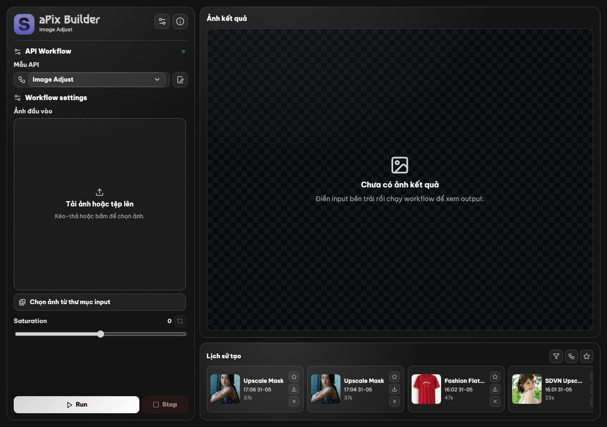
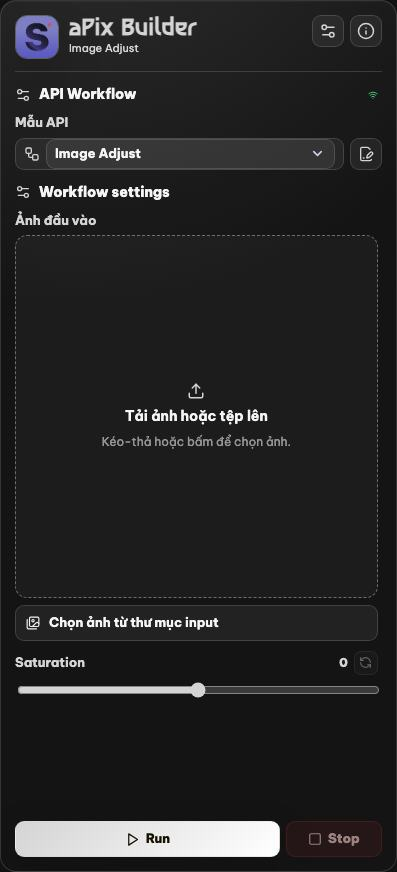
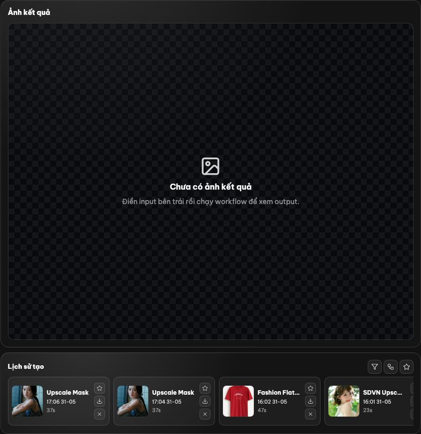
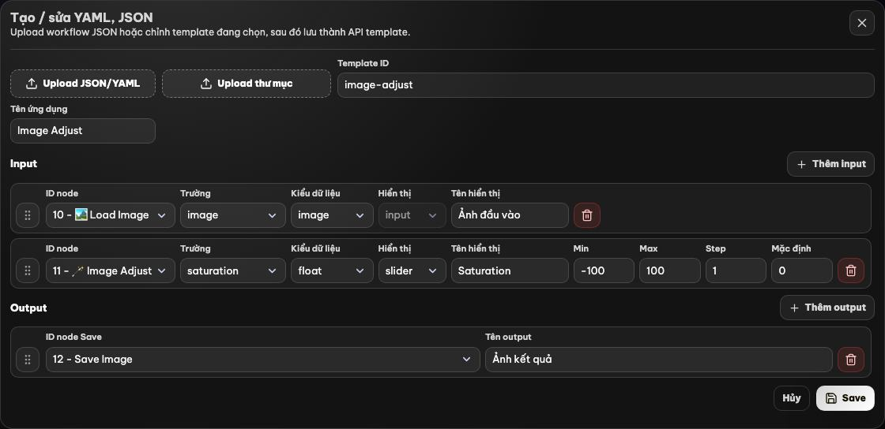
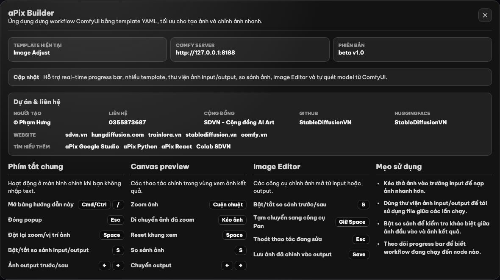

# aPix Builder

aPix Builder là ứng dụng web dùng để chạy, quản lý và chỉnh sửa workflow ComfyUI bằng template YAML. Dự án gồm frontend React/Vite và backend Node.js trung gian để đọc template, vá workflow API JSON, upload ảnh vào ComfyUI, theo dõi tiến trình, lưu lịch sử output và quản lý thư viện ảnh input cục bộ.

Ứng dụng phù hợp cho các workflow tạo ảnh hoặc chỉnh ảnh lặp lại nhiều lần, nơi người dùng cần giao diện gọn hơn ComfyUI gốc, có preset input, lịch sử output, preview ảnh, so sánh trước/sau và công cụ chỉnh ảnh nhanh.

## Preview

Khi chạy local, giao diện mặc định mở tại:

```txt
http://localhost:5173/
```

### Ảnh minh họa

| Tổng quan ứng dụng | Workflow panel |
| --- | --- |
|  |  |

| Preview và lịch sử | Template Editor |
| --- | --- |
|  |  |



Màn hình chính gồm:

- Cột cấu hình bên trái: chọn template, nhập địa chỉ ComfyUI, thay đổi input workflow, chọn ảnh từ thư mục input.
- Vùng preview trung tâm: xem ảnh output, zoom/pan, so sánh input/output, chuyển giữa nhiều output.
- Thanh lịch sử bên dưới: mở lại lần chạy cũ, tải ảnh, đánh dấu yêu thích, kéo ảnh output vào ô upload input.
- Modal chỉnh ảnh: crop, brush, eraser, healing, color picker, pen/select, curves, HSL, effects, preset chỉnh ảnh.

## Tính năng chính

- Chạy workflow ComfyUI qua API với địa chỉ server tùy chỉnh.
- Template hóa workflow bằng `app_build.yaml` và `api.json`.
- Tự quét model/checkpoint/LoRA/sampler/scheduler từ ComfyUI để đổ vào các input động.
- Upload ảnh trực tiếp, kéo-thả ảnh, chọn ảnh từ thư mục `input/`.
- Kéo ảnh từ lịch sử output vào ô upload input để tái sử dụng nhanh.
- Theo dõi tiến trình real-time bằng Server-Sent Events.
- Hàng chờ chạy workflow: bấm Run khi đang chạy sẽ thêm request mới vào queue.
- Stop workflow đang chạy và gửi interrupt/cancel sang ComfyUI.
- Lưu lịch sử output trong `output/history.json`, giới hạn 50 mục gần nhất.
- Tải output về máy, đánh dấu favorite, xóa lịch sử.
- Image Editor tích hợp cho input và output.
- Mask Editor cho input image mask.
- Nhiều theme và font hiển thị.
- Template Editor để tạo/sửa cấu hình YAML và workflow JSON ngay trong app.

## Yêu cầu

- Node.js `20.19.0` trở lên hoặc `22.12.0` trở lên.
- npm đi kèm Node.js.
- ComfyUI đang chạy, mặc định tại:

```txt
http://127.0.0.1:8188
```

ComfyUI cần bật API HTTP/WebSocket như cấu hình mặc định. Nếu ComfyUI chạy ở máy hoặc port khác, nhập URL đầy đủ trong ô `ComfyUI address`.

## Cài đặt Node.js

Nên dùng bản LTS mới nhất từ Node.js để tương thích với Vite 7. Kiểm tra sau khi cài:

```bash
node -v
npm -v
```

### macOS

Cách nhanh nhất là dùng Homebrew:

```bash
brew install node
```

Nếu chưa có Homebrew, có thể tải bộ cài `.pkg` từ trang chính thức:

```txt
https://nodejs.org/
```

### Windows

Tải bản LTS từ trang chính thức và chạy file `.msi`:

```txt
https://nodejs.org/
```

Trong trình cài đặt, giữ tùy chọn cài npm mặc định. Sau khi cài xong, mở lại PowerShell hoặc Command Prompt rồi kiểm tra `node -v` và `npm -v`.

### Linux

Với Ubuntu/Debian, nên cài qua NodeSource để có phiên bản Node.js mới:

```bash
curl -fsSL https://deb.nodesource.com/setup_22.x | sudo -E bash -
sudo apt-get install -y nodejs
```

Với Fedora:

```bash
sudo dnf install nodejs npm
```

Với Arch Linux:

```bash
sudo pacman -S nodejs npm
```

## Cài đặt

Clone repository và cài dependency:

```bash
git clone <repository-url>
cd aPix_Builder
npm install
```

## Khởi động nhanh

Sau khi đã cài dependency, có thể khởi động app bằng file start thiết kế sẵn cho từng hệ điều hành:

| Hệ điều hành | Tệp khởi động | Cách chạy |
| --- | --- | --- |
| macOS | `Start-mac.command` | Double-click file trong Finder. Nếu macOS chặn quyền chạy, mở Terminal tại thư mục dự án và chạy `chmod +x Start-mac.command`. |
| Windows | `Start-windows.bat` | Double-click file trong File Explorer. Cửa sổ terminal sẽ giữ lại sau khi app dừng để xem log. |
| Linux | `Start-linux.sh` | Mở Terminal tại thư mục dự án, chạy `chmod +x Start-linux.sh` nếu cần, sau đó chạy `./Start-linux.sh`. |

Các tệp này đều gọi:

```bash
npm run start:app
```

Lệnh này sẽ:

- Cài dependency nếu chưa có `node_modules`.
- Khởi động backend Node.js.
- Khởi động Vite frontend tại `http://localhost:5173/`.
- Tự mở trình duyệt sau khi frontend sẵn sàng.

Nếu muốn chạy thủ công, mở hai terminal riêng:

```bash
npm run server
```

```bash
npm run dev
```

## Script

| Lệnh | Mô tả |
| --- | --- |
| `npm run start:app` | Khởi động backend và frontend, tự mở browser. |
| `npm run server` | Chạy backend Node.js tại port `8787` mặc định. |
| `npm run dev` | Chạy Vite dev server tại `5173`. |
| `npm run build` | Build frontend production vào thư mục `dist/`. |
| `npm run preview` | Preview bản build production bằng Vite. |

## Cấu trúc dự án

| Đường dẫn | Nội dung |
| --- | --- |
| `src/` | Frontend React, component UI, hook xử lý state và tương tác. |
| `server/` | Backend Node.js, API local, tích hợp ComfyUI, lưu input/output. |
| `config/default/` | Template mặc định đi kèm dự án. |
| `config/templates/` | Nơi lưu template người dùng tạo thêm. |
| `input/` | Thư viện ảnh input cục bộ. |
| `output/` | Ảnh output đã archive và file `history.json`. |
| `uploads/` | File upload tạm khi gửi sang workflow. |
| `presets/` | Preset chỉnh ảnh của Image Editor. |
| `scripts/start-app.mjs` | Script khởi động app một lệnh. |

## Template workflow

Mỗi template thường gồm:

- `app_build.yaml`: mô tả tên app, input UI, output UI và server mặc định.
- `api.json`: workflow API JSON export từ ComfyUI.

Ví dụ template mặc định nằm tại:

```txt
config/default/image-adjust/
```

Trong YAML, mỗi input map tới một node/field của workflow bằng `id`. Backend sẽ đọc YAML, nhận giá trị từ UI, vá vào `api.json`, upload ảnh nếu cần, queue prompt sang ComfyUI và archive output sau khi hoàn tất.

## Hướng dẫn sử dụng

1. Mở ComfyUI và đảm bảo truy cập được API, ví dụ `http://127.0.0.1:8188`.
2. Chạy app bằng `npm run start:app`.
3. Trong app, chọn `Mẫu API`.
4. Nhập hoặc kiểm tra `ComfyUI address`.
5. Điền input workflow: prompt, slider, dropdown, ảnh upload hoặc ảnh từ thư viện input.
6. Bấm `Run`.
7. Theo dõi tiến trình trong màn hình chờ.
8. Khi hoàn tất, xem output ở vùng preview.
9. Dùng lịch sử để tải ảnh, mở lại prompt cũ, favorite hoặc kéo output vào input cho lần chạy tiếp theo.
10. Mở Image Editor nếu cần crop/chỉnh màu/retouch trước khi lưu lại vào output.

## Quản lý ảnh

- Ảnh input được lưu trong thư mục `input/`.
- Ảnh output được lưu trong thư mục `output/`.
- Lịch sử output được lưu tại `output/history.json`.
- Có thể kéo-thả file ảnh từ máy vào ô upload.
- Có thể kéo ảnh từ thanh lịch sử output vào ô upload input.
- Thư viện input hỗ trợ lọc theo thời gian, favorite, xem ảnh lớn và xóa ảnh.

## Image Editor

Image Editor hỗ trợ:

- Crop, rotate, flip.
- Basic adjustment: luminance, contrast, saturation, vibrance, temperature, tint.
- Curves và histogram.
- HSL theo kênh màu.
- Effects như clarity, dehaze, noise.
- Brush, eraser, healing brush.
- Rectangle select, ellipse select, pen path.
- Color picker.
- Preset chỉnh ảnh.
- So sánh trước/sau và lưu ảnh đã chỉnh vào output history.

## Phím tắt

### Màn hình chính

| Phím | Chức năng |
| --- | --- |
| `Cmd/Ctrl + /` | Mở bảng thông tin/hướng dẫn trong app. |
| `Esc` | Đóng popup đang mở. |
| `Space` | Reset zoom và vị trí ảnh preview. |
| `S` | Bật/tắt so sánh input/output. |
| `←` | Chuyển sang output trước nếu workflow có nhiều output. |
| `→` | Chuyển sang output sau nếu workflow có nhiều output. |
| `Enter` hoặc `Space` trên item lịch sử | Mở lại item lịch sử đang focus. |

### Canvas preview

| Thao tác | Chức năng |
| --- | --- |
| Cuộn chuột | Zoom ảnh preview. |
| Kéo ảnh | Pan ảnh sau khi zoom. |
| Kéo vạch so sánh | Điều chỉnh vùng so sánh input/output. |

### Image Editor

| Phím | Chức năng |
| --- | --- |
| `Cmd/Ctrl + Z` | Undo. |
| `Cmd/Ctrl + Shift + Z` | Redo. |
| `Cmd/Ctrl + +` | Phóng to canvas editor. |
| `Cmd/Ctrl + -` | Thu nhỏ canvas editor. |
| Giữ `Space` | Tạm chuyển sang Hand/Pan. |
| Giữ `Alt` | Tạm chuyển sang Color Picker. |
| `1` | Mở/đóng nhóm Basic. |
| `2` | Mở/đóng nhóm Curves. |
| `3` | Mở/đóng nhóm HSL. |
| `4` | Mở/đóng nhóm Effects. |
| `5` | Mở/đóng nhóm Export. |
| `C` | Chọn Crop. |
| `Enter` khi đang Crop | Áp dụng crop hiện tại. |
| `S` | Bật/tắt so sánh trước/sau. |
| `R` | Xoay ảnh 90 độ. |
| `H` | Chọn Hand/Pan. |
| `B` | Chọn Brush. |
| `E` | Chọn Eraser. |
| `I` | Chọn Color Picker. |
| `Z` | Chọn Zoom. |
| `J` | Chọn Healing. |
| `P` | Chọn Pen. |
| `M` | Chọn Rectangle Select. |
| `Shift + M` | Chọn Ellipse Select. |
| `[` | Giảm kích thước brush. |
| `]` | Tăng kích thước brush. |

### Mask Editor

| Phím | Chức năng |
| --- | --- |
| `Esc` | Đóng Mask Editor. |
| `Cmd/Ctrl + Z` | Undo. |
| `Cmd/Ctrl + Shift + Z` | Redo. |
| `Cmd/Ctrl + Enter` | Fill pen path. |
| `Space` | Tạm pan canvas. |
| `+` hoặc `=` | Phóng to. |
| `-` hoặc `_` | Thu nhỏ. |
| `0` | Reset view. |
| `B` | Chọn Brush. |
| `E` | Chọn Erase. |
| `H` | Chọn Pan. |
| `P` | Chọn Pen. |
| `[` | Giảm kích thước brush. |
| `]` | Tăng kích thước brush. |

### Template Editor

| Phím | Chức năng |
| --- | --- |
| `ArrowUp` trên handle input/output | Di chuyển dòng lên. |
| `ArrowDown` trên handle input/output | Di chuyển dòng xuống. |

## Thông tin dự án

- Người tạo: [© Phạm Hưng](https://www.facebook.com/phamhungd/)
- Liên hệ: [0355873687](https://zalo.me/0355873687)
- Cộng đồng: [SDVN - Cộng đồng AI Art](https://www.facebook.com/groups/stablediffusion.vn)
- Website: [sdvn.vn](https://sdvn.vn) | [hungdiffusion.com](https://hungdiffusion.com) | [trainlora.vn](https://trainlora.vn) | [stablediffusion.vn](https://stablediffusion.vn) | [comfy.vn](https://comfy.vn)
- GitHub: [StableDiffusionVN](https://github.com/StableDiffusionVN/)
- HuggingFace: [StableDiffusionVN](https://huggingface.co/StableDiffusionVN/)

Tìm hiểu thêm các dự án:

- [aPix Google Studio](https://aistudio.google.com/app/u/0/apps/d798af97-ec18-4946-bce4-3b5b0e7d403e?showPreview=true&showAssistant=true&fullscreenApplet=true)
- [aPix Python](https://github.com/StableDiffusionVN/sdvn_apix_python)
- [aPix React](https://github.com/StableDiffusionVN/sdvn_apix_react)
- [Colab SDVN](https://sdvn.me)

## Biến môi trường

| Biến | Mặc định | Mô tả |
| --- | --- | --- |
| `PORT` | `8787` | Port backend Node.js. |
| `COMFY_TIMEOUT_MS` | `600000` | Timeout chờ workflow ComfyUI hoàn tất. |
| `MAX_IMAGE_BODY_BYTES` | `536870912` | Kích thước body tối đa khi upload/lưu ảnh qua API local. |

## Build production

```bash
npm run build
npm run preview
```

Backend Node.js vẫn cần chạy riêng nếu muốn dùng đầy đủ API local và tích hợp ComfyUI.

## Ghi chú Git

Các thư mục `input/`, `output/`, `uploads/` và `presets/` thường chứa dữ liệu local của người dùng. Khi public repository, nên cân nhắc `.gitignore` các file ảnh hoặc dữ liệu riêng tư nếu không muốn đưa lên GitHub.
